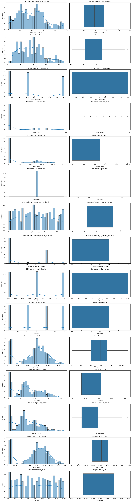
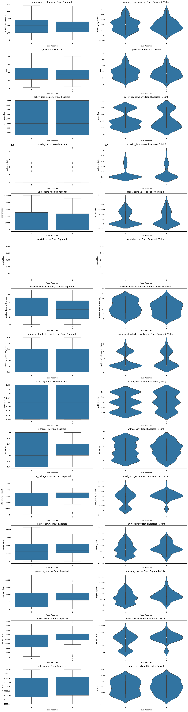

# **Fraudulent Claim Detection**
**Submitted By:** Shivanshu Kumar Singh | Ankit Srivastava

- [**Fraudulent Claim Detection Report**](#fraudulent-claim-detection-report)
  - [**1. Introduction**](#1-introduction)
    - [**1.1 Problem Statement**](#11-problem-statement)
    - [**1.2 Business Objective**](#12-business-objective)
  - [**2. Methodology**](#2-methodology)
    - [**2.1 Data Preparation and Cleaning**](#21-data-preparation-and-cleaning)
    - [**2.2 Exploratory Data Analysis (EDA)**](#22-exploratory-data-analysis-eda)
      - [**2.2.1 Univariate Analysis**](#221-univariate-analysis)
        - [**2.2.1.1 Key Conclusions**](#2211-key-conclusions)
        - [**2.2.1.2 Business Implications**](#2212-business-implications)
      - [**2.2.2 Bivariate Analysis**](#222-bivariate-analysis)
        - [**2.2.2.1 Key Takeaways**](#2221-key-takeaways)
        - [**2.2.2.2 Business Implications**](#2222-business-implications)
    - [**2.3 Feature Engineering**](#23-feature-engineering)
    - [**2.4 Model Building**](#24-model-building)
      - [**2.4.1 Logistic Regression**](#241-logistic-regression)
      - [**2.4.2 Random Forest**](#242-random-forest)
  - [**3. Results and Insights**](#3-results-and-insights)
    - [**3.1 Logistic Regression Performance**](#31-logistic-regression-performance)
    - [**3.2 Random Forest Performance**](#32-random-forest-performance)
    - [**3.3 Key Insights**](#33-key-insights)
  - [**4. Conclusion \& Recommendations**](#4-conclusion--recommendations)

## **1. Introduction**  
### **1.1 Problem Statement**  
Global Insure, a leading insurance company, processes thousands of claims annually. A significant percentage of these claims turn out to be fraudulent, leading to financial losses. The company currently relies on manual inspections for fraud detection, which is inefficient and time-consuming. This project aims to improve the fraud detection process using **data-driven insights**, allowing early classification of claims as fraudulent or legitimate.  

### **1.2 Business Objective**  
The goal is to develop a machine learning model that classifies insurance claims as fraudulent or legitimate based on historical claim details and customer profiles. Features such as claim amounts, customer details, and claim types are used to predict fraudulent claims before approval, **reducing financial losses and optimizing the claims process**.  

## **2. Methodology**  
### **2.1 Data Preparation and Cleaning**  
- The dataset consists of **40 columns and 1000 rows**.  
- Missing values were handled via imputation strategies such as **mode replacement** for categorical features and specific treatments for missing values in `property_damage` and `police_report_available` columns.  
- Redundant columns were dropped based on uniqueness analysis (e.g., `policy_number` and `_c39`).  

### **2.2 Exploratory Data Analysis (EDA)**  
#### **2.2.1 Univariate Analysis**  

- Distribution plots and boxplots were used to understand the spread of numerical features such as `total_claim_amount`, `injury_claim`, and `vehicle_claim`.  
- Categorical features like `incident_type` and `insured_hobbies` were analyzed to identify common trends in fraudulent claims.

##### **2.2.1.1 Key Conclusions**
1. **Fraud Detection & Risk Indicators:**  
   - Policyholders with **multiple open claims** and **high deductible policies** could indicate potential fraud risk.  
   - Claims involving **higher than usual vehicle repairs, property damage, or injury compensation** often contain outliers and should be further investigated.  

2. **Common Customer Characteristics:**  
   - Most customers are around **40 years old**, hold policies for **100 months**, and have **standard deductibles (500 to 1000 units)**.  
   - Most incidents involve **single vehicles**, occur **around midday**, and report **low bodily injuries** or **few witnesses**.  

##### **2.2.1.2 Business Implications**
   - **Vehicle manufacturing year (mostly between 2000-2010)** suggests policyholders often insure **older cars**, which could lead to **higher maintenance or repair claims**.  
   - **High claim amounts (>15,000)** may indicate fraudulent attempts or exaggerated claim values.

#### **2.2.2 Bivariate Analysis**  

- Correlation heatmaps revealed strong relationships between claim amounts.  
- Fraud likelihood analysis showed that claims **involving vehicle collisions, high deductibles, and certain occupations** had a higher probability of being fraudulent.

##### **2.2.2.1 Key Takeaways**
- **New customers and younger individuals** are **more prone to fraudulent claims**.
- **High claim amounts and high deductibles** are **strong fraud indicators**.
- **Single-vehicle collisions, severe incidents, and side collisions** are **most likely fraudulent**.
- **Lack of a police report or "unknown" property damage increases fraud likelihood**.
- **Luxury vehicle claims require additional scrutiny**.

##### **2.2.2.2 Business Implications**
- **Flag new policyholders and high deductible claims for additional verification.**
- **Use claim ratio and severity as key fraud risk indicators.**
- **Improve fraud detection by integrating police report checks and monitoring suspicious authorities contacted.**

### **2.3 Feature Engineering**  
- Derived **customer tenure years** from `months_as_customer`.  
- Created a **claim ratio feature**, which captures the proportion of the total claim amount relative to individual claim components.  
- Introduced binary flags such as **incident during night hours (20:00-06:00)**.  

### **2.4 Model Building**  
#### **2.4.1 Logistic Regression**  
- **Feature selection** was performed using Recursive Feature Elimination (RFECV).  
- The logistic regression model was trained and evaluated using stratified train-validation split (**70-30 ratio**).  
- Model evaluation included accuracy, sensitivity, precision, and F1-score calculations.  
- **Optimal probability cutoff** for classification was determined using a sensitivity-specificity tradeoff curve.  

#### **2.4.2 Random Forest**  
- Feature importance analysis guided selection of key predictors.  
- The model was optimized through **hyperparameter tuning using GridSearchCV**.  
- Cross-validation ensured the model was **not overfitting** to training data.  

## **3. Results and Insights**  
### **3.1 Logistic Regression Performance**  
**Validation Metrics:**  
- **Accuracy:** 76.92%  
- **Sensitivity (Recall):** 64.71%  
- **Specificity:** 80.73%  
- **Precision:** 51.16%  
- **F1 Score:** 57.14%  

### **3.2 Random Forest Performance**  
**Validation Metrics:**  
- **Accuracy:** 76.92%  
- **Sensitivity (Recall):** 23.53%  
- **Specificity:** 93.57%  
- **Precision:** 53.33%  
- **F1 Score:** 32.65%  

### **3.3 Key Insights**  
1. **Occupations such as ‘armed-forces’ and ‘exec-managerial’ showed higher fraudulent claim likelihood.**  
2. **Incident severity, particularly ‘major damage’, had a strong correlation with fraud detection.**  
3. **Police reports and property damage indicators contributed significantly to fraud classification.**  
4. **Random Forest was found to be highly effective in capturing complex fraud patterns.**  
5. **Sensitivity in detecting fraud was lower for Random Forest, suggesting potential optimization with further tuning.**  

## **4. Conclusion & Recommendations**  
- **Deploy Random Forest in production for real-time fraud detection** due to its superior predictive performance.  
- Continuously **update the model with new claim data** to refine fraud detection patterns.  
- Implement **additional business logic for detecting fraudulent trends**, such as **flagging claims with excessive vehicle damage requests**.  
- Further **fine-tune model hyperparameters** to **improve sensitivity** without compromising specificity.
